  

[LinkedIn](https://www.linkedin.com/in/ig-russi/) &nbsp;·&nbsp; [Portfolio](https://portfolio-pi-virid-82.vercel.app) &nbsp;·&nbsp; [Dati](https://dati.digital)

 

 

## Sobre

Arquiteto de Soluções & IA na **[Dati](https://dati.digital)** — desenho e construo sistemas com IA generativa e agentes autônomos rodando na AWS. Claude, Kiro e frameworks multi-agente são minhas ferramentas de todo dia, não buzzwords.

Antes da nuvem, passei quatro anos editando vídeo para um canal com milhares de inscritos — é de lá que vem a atenção ao detalhe visual.

|  |  |
|---|---|
| **Hoje** | Arquiteturas de IA, integrações, automações e agentes em produção |
| **Formação** | Análise e Desenvolvimento de Sistemas, 2025–2027 |
| **Certificações** | AWS Cloud Practitioner · AWS AI Practitioner |
| **Base** | Blumenau, Santa Catarina, Brasil |

 

## Stack

| Domínio | Tecnologias |
|---|---|
| Cloud & IA | AWS · Bedrock · IA generativa · agentes multi-framework · Docker · Linux |
| Backend | Python · Java · Spring Boot · Node.js · APIs REST |
| Frontend | React · TypeScript · JavaScript · HTML · CSS · Tailwind |
| Ferramentas | Git · GitHub Actions · Vercel · Figma |

 

## Atividade

  

  

<picture>
  <source media="(prefers-color-scheme: dark)" srcset="https://raw.githubusercontent.com/IagoRussi/IagoRussi/output/github-snake-dark.svg" />
  <source media="(prefers-color-scheme: light)" srcset="https://raw.githubusercontent.com/IagoRussi/IagoRussi/output/github-snake.svg" />
  
</picture>

 

Esta página se atualiza sozinha via GitHub Actions — como tudo que eu construo, ela trabalha enquanto eu durmo.

