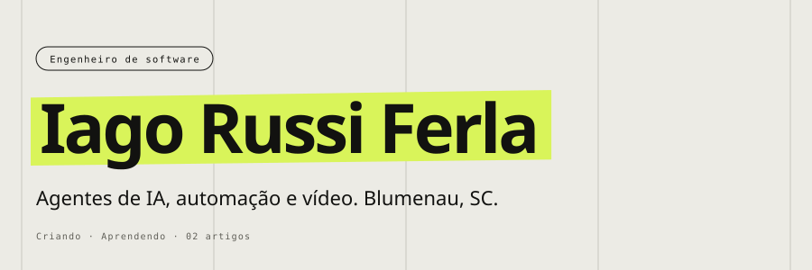
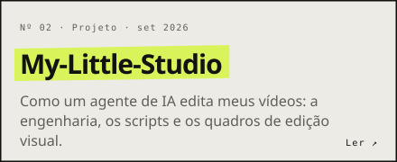
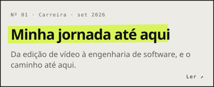

   

## Sobre

Engenheiro de software em Blumenau (SC). Trabalho de forma autônoma com agentes de IA, pipelines e automação: tiro das equipes as horas de trabalho repetitivo.

| | |
|---|---|
| **Hoje** | Agentes de IA, pipelines e automação, como autônomo |
| **Formação** | Engenharia de Software, 2025–2029 |
| **Base** | Blumenau, Santa Catarina, Brasil |

## Artigos

 

## No que eu venho trabalhando

- **[My-Little-Studio](https://iago-russi.vercel.app/artigos/pipeline/)**. Um estúdio de vídeo que roda sozinho: pega a gravação crua e entrega o vídeo editado, com corte, som tratado, legenda e animação. Eu opero tudo conversando com o Claude.
- **Fábrica de geração de vídeo**. Um pipeline autônomo de geração de vídeo com os modelos do Replicate, automatizando o processo inteiro para baixar o custo e melhorar o resultado.
- **Copiloto de tela por voz**. Um modelo que vê o que está na minha tela e me responde em tempo real enquanto eu falo com ele.
- **Consultoria e palestras sobre IA**. Participo de consultorias que ensinam empresas a usar IA, e dou palestras sobre como usar agentes melhor.

## Vamos conversar

O primeiro contato é por e-mail: **[iagorussi@gmail.com](mailto:iagorussi@gmail.com)**. Me chama por lá que a gente conversa.

No mesmo estilo do meu site, <a href="https://iago-russi.vercel.app">iago-russi.vercel.app</a>.

